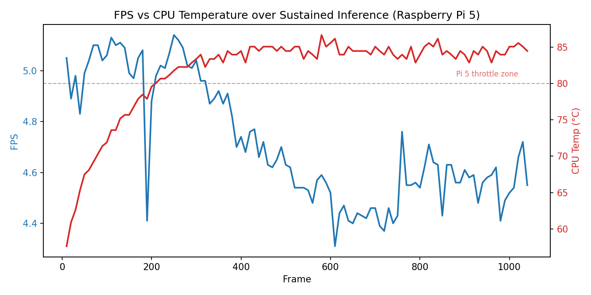
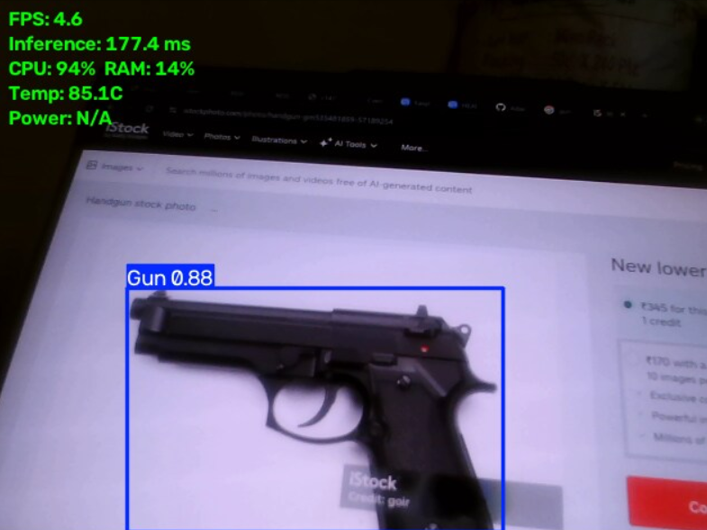
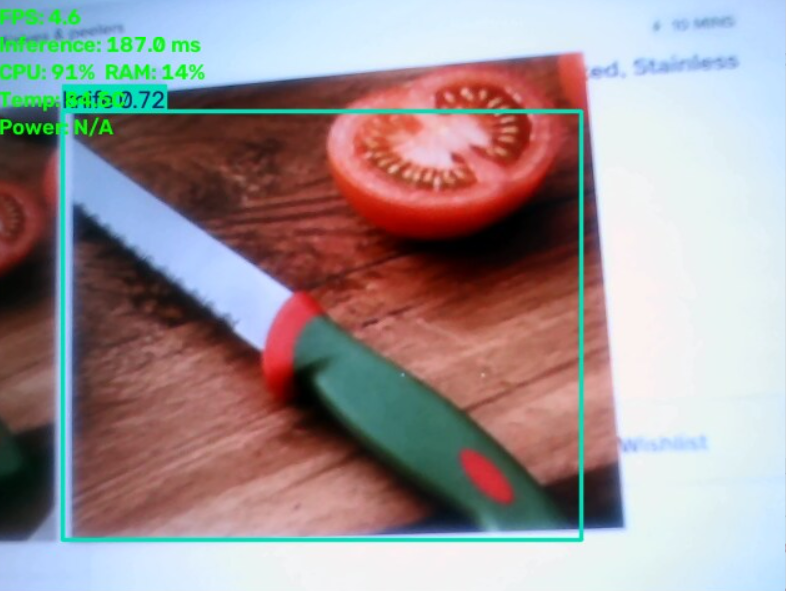

# Real-Time Weapon Detection on Raspberry Pi 5 — Edge Deployment & Benchmarking

An end-to-end edge AI pipeline that takes a YOLOv8n weapon-detection model from a trained
checkpoint to a running, benchmarked, real-time system on a Raspberry Pi 5 — covering model
export, deployment, live inference, temporal decision logic, alerting, and full hardware
benchmarking (FPS, latency, CPU, RAM, temperature, and power draw).

## Pipeline

```
Pretrained YOLOv8n weapon-detection checkpoint (see Model & Attribution)
                    ↓
        Export: .pt → ONNX (opset 12, simplified)
                    ↓
          Deploy on Raspberry Pi 5
                    ↓
       OpenCV USB camera capture pipeline
                    ↓
          Real-time per-frame detection
                    ↓
   Temporal validation (K-of-N frame consensus)
                    ↓
      Alert / safety action (snapshot + log)
                    ↓
   FPS, latency, CPU/RAM/temp/power benchmarking
```

This is deliberately not "load a model and draw boxes." The two stages after detection —
**temporal validation** and **alert logic** — exist because a single-frame detection on a
security-relevant system is not trustworthy on its own; the pipeline requires a class to be
confirmed across multiple consecutive frames before it's treated as an actual alert, which
cuts down on false positives from motion blur, lighting changes, or momentary
misclassification.

## Model & Attribution

Detection weights: [`Subh775/Threat-Detection-YOLOv8n`](https://huggingface.co/Subh775/Threat-Detection-YOLOv8n)
(YOLOv8n, 4 classes: Gun, Explosive, Grenade, Knife). This project uses the pretrained
checkpoint as-is and focuses on the **export → deployment → decision logic → benchmarking**
pipeline described above, not on training the base model. Reported class-level metrics from
the original model card:

| Class | mAP@50 | Precision | Recall |
|---|---|---|---|
| Gun | 93.1% | 96.7% | 83.0% |
| Grenade | 91.1% | 93.1% | 83.0% |
| Knife | 79.7% | 86.5% | 83.0% |
| Explosive | 60.5% | 49.7% | 83.0% |
| **Overall** | **81.1%** | **81.5%** | **83.0%** |

The Explosive class has a notably weaker precision (~50%), meaning more false positives for
that class specifically — worth knowing before trusting its output in isolation.

## Hardware & Setup

- Raspberry Pi 5 (passive cooling, no active fan during this test run)
- USB webcam
- Python virtual environment, Ultralytics, OpenCV, psutil

```bash
python3 -m venv yolo-env
source yolo-env/bin/activate
pip install ultralytics opencv-python psutil
```

Place the exported `best.onnx` at `models/best.onnx` (or update `MODEL_PATH` in
`scripts/weapon_detect_pipeline.py`), then run:

```bash
python3 scripts/weapon_detect_pipeline.py
```

Press `q` in the video window to quit. Two logs are produced automatically:
- `results/benchmark_log.csv` — FPS/latency/CPU/RAM/temp/power, logged every 10 frames
- `results/alerts.csv` — confirmed detections, with a saved annotated snapshot per alert

## Benchmark Results

Measured live on Raspberry Pi 5, 1040 frames of sustained inference, USB webcam, ONNX
runtime, 640×640 input:

| Metric | Value |
|---|---|
| Mean FPS | 4.72 |
| Mean inference latency | 176.9 ms |
| Mean CPU utilization | 90.6% |
| Mean RAM utilization | 14.4% |
| CPU temperature range | 57.6°C → 86.7°C |

### Finding: thermal throttling under sustained load

CPU temperature climbed steadily over the run and FPS degraded as a direct result —
correlation between temperature and FPS across the run was **-0.59**. Comparing the first
and last 20% of frames:

| | Early (frames 10–200) | Late (frames 850–1040) |
|---|---|---|
| Avg FPS | 4.99 | 4.57 |
| Avg CPU temp | 71.5°C | 84.3°C |



The Pi 5 begins throttling in the low-80s °C range on passive cooling, which lines up with
where the FPS drop-off starts in the data above. **Practical implication: sustained
real-time inference on a Pi 5 needs active cooling (fan or heatsink+fan combo) to hold peak
throughput** — this system was tested without one, and the numbers above reflect that.

### Known limitation: power measurement

`power_w` is unlogged in this run — the Pi 5's onboard PMIC power read (`vcgencmd
pmic_read_adc`) didn't return parseable output on this OS/firmware build. The code to parse
it is in place (`get_pmic_power()` in the script) for future runs where it's supported; an
inline USB-C power meter is a reliable hardware-based fallback for getting this number.

## Detection Examples

**Gun detection:**



**Knife detection:**



## Repository Structure

```
weapon-detection-edge-pi5/
├── README.md
├── models/
│   └── best.onnx                      # exported ONNX weights (place here)
├── scripts/
│   └── weapon_detect_pipeline.py      # detection + temporal validation + alerts + benchmarking
├── results/
│   ├── benchmark_log.csv              # raw FPS/CPU/RAM/temp/power log
│   ├── fps_vs_temp.png                # thermal throttling chart
│   └── screenshots/
│       ├── detection_gun.png
│       └── detection_knife.png
└── requirements.txt
```

## Limitations & Future Work

- Base model is used pretrained, not fine-tuned on additional/custom data — a natural next
  step would be fine-tuning on a domain-specific dataset (e.g. CCTV-angle footage) to close
  the Explosive-class precision gap.
- Power draw logging needs a working PMIC read path or an external USB power meter for
  reliable numbers.
- No active cooling was used during benchmarking; results with a fan attached would be a
  useful comparison.
- Not validated for production security use — this is a demonstrated pipeline with measured
  performance characteristics, not a deployed safety system.
