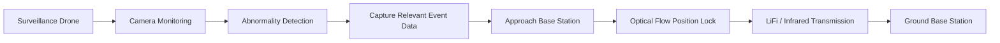

# GPS-Denied Surveillance Drone with Optical Communication

<p align="center">
  
</p>

<p align="center">
  <b>Prototype demonstrated at India Mobile Congress (IMC) 2025</b><br>
  <b>Project Mentor: Dr. Divyang Rawal</b>
</p>

## Overview

This project explores a **surveillance drone communication system for GPS-denied and RF-constrained environments**, with a focus on defence and remote-surveillance applications.

The proposed system allows a drone to detect an abnormal event, collect relevant information, navigate above a base station, stabilize its position using **optical flow**, and transmit the captured information to the base station using **LiFi / infrared optical communication** instead of conventional RF communication.

A weapon-detection model was used as an **example abnormality-detection application** to demonstrate how useful event information could be generated onboard the surveillance platform.

The prototype was presented at **India Mobile Congress (IMC) 2025**.

> **Prototype status:** The major subsystems were successfully developed and demonstrated individually. A completely autonomous end-to-end flight integrating every subsystem into a single sequence was not completed during the prototype stage.

---

# Concept

The intended operational sequence is:



An example mission would be:

1. The surveillance drone monitors an area using its onboard camera.
2. An abnormal event is detected.
3. Relevant information such as an image of the detected event is captured.
4. The drone moves above the optical communication base station.
5. Optical-flow sensing is used to help stabilize the drone relative to the ground.
6. The drone establishes an optical communication link.
7. Event information is transmitted to the ground receiver using infrared/light communication.

This architecture is intended for scenarios where **GPS may be unavailable or unreliable** and where an alternative to conventional RF communication is desirable.

---

# Prototype Subsystems

The complete concept was divided into four major experimental demonstrations.

## 1. Vision-Based Abnormality Detection

For the prototype, **weapon detection** was used as an example of an abnormality-detection task.

A camera feed is processed using an object-detection model to identify potential threats such as weapons.

The purpose of this stage is not limited to weapon detection. The detection subsystem can potentially be replaced with other computer-vision models depending on the surveillance mission.

Examples could include:

- Intrusion detection
- Person detection
- Fire/smoke detection
- Suspicious-object detection
- Vehicle detection
- Infrastructure inspection

### Demonstration

[▶ Watch Weapon Detection Demonstration](media/demos/01_weapon_detection.mp4)

---

## 2. Optical-Flow-Based Drone Position Lock

Accurate optical communication requires the drone to maintain a sufficiently stable position with respect to the ground receiver.

An **optical flow sensor** was therefore tested for position stabilization.

Optical flow estimates relative motion by observing the movement of visual features on the ground. This information can be used by the drone's flight-control system to reduce horizontal drift, particularly where GPS positioning is unavailable.

### Demonstration

[▶ Watch Optical Flow Position-Lock Demonstration](media/demos/02_optical_flow_position_lock.mp4)

---

## 3. Infrared Data Communication

An infrared transmitter and receiver were developed to evaluate optical data communication over different distances.

The communication link was experimentally tested under laboratory conditions.

### Experimental Results

| Distance | Achieved Data Rate |
|---:|---:|
| **20 ft** | **52 kbps** |
| **12 ft** | **156 kbps** |
| **6 ft** | **600 kbps** |

The results demonstrate the expected trade-off between **communication distance and achievable data rate** in the prototype optical link.

At shorter distances, the receiver obtains a stronger optical signal, allowing significantly higher data rates.

### Demonstration

[▶ Watch 20 ft IR Communication Demonstration](media/demos/03_ir_communication_20ft.mp4)

---

## 4. Drone-to-Ground Laser Communication

To verify that an optical transmitter could operate while mounted on an aerial platform, a laser-based communication experiment was also conducted.

A laser transmitter was attached to the drone and data transmission toward the ground receiver was demonstrated during flight.

This experiment primarily validated the feasibility of establishing an **air-to-ground directional optical communication link**.

The laser communication demonstration and optical-flow position-lock demonstration were performed separately during this prototype stage.

### Demonstration

[▶ Watch Drone Laser Communication Demonstration](media/demos/04_drone_laser_communication.mp4)

---

# System Architecture

```text
                    SURVEILLANCE DRONE
┌─────────────────────────────────────────────────────┐
│                                                     │
│                Camera / Vision Input                │
│                         │                           │
│                         ▼                           │
│                Abnormality Detection                │
│               (Weapon Detection Demo)               │
│                         │                           │
│                         ▼                           │
│                 Event Data Capture                  │
│                  (Image / Metadata)                 │
│                                                     │
│       Optical Flow ─────► Position Stabilization    │
│                                  │                  │
│                                  ▼                  │
│                       Optical Transmitter            │
│                       (IR / Laser / LiFi)            │
│                                  │                  │
└──────────────────────────────────┼──────────────────┘
                                   │
                          Optical Downlink
                                   │
                                   ▼
                    ┌────────────────────────┐
                    │      BASE STATION      │
                    │                        │
                    │   Optical Receiver     │
                    │          │             │
                    │          ▼             │
                    │     Data Recovery      │
                    │          │             │
                    │          ▼             │
                    │ Surveillance Output    │
                    └────────────────────────┘
```

---

# Why Optical Communication?

Traditional surveillance drones generally depend on RF links and GNSS/GPS-based navigation.

The project investigates **optical wireless communication** as an additional communication mechanism.

Potential advantages include:

- High directional selectivity
- Reduced RF spectrum dependency
- Difficult-to-intercept narrow optical beams
- High potential communication bandwidth
- Useful communication alternative in RF-constrained environments
- Compatibility with infrared wavelengths invisible to the human eye

The prototype focuses on demonstrating the feasibility of the underlying subsystems rather than claiming a production-ready defence communication system.

---

# Demonstrated Results

| Subsystem | Demonstrated |
|---|:---:|
| Camera-based weapon/anomaly detection | ✅ |
| Event detection using computer vision | ✅ |
| Optical-flow-based position stabilization | ✅ |
| IR transmitter and receiver | ✅ |
| IR communication at 20 ft | ✅ |
| 52 kbps communication at 20 ft | ✅ |
| 156 kbps communication at 12 ft | ✅ |
| 600 kbps communication at 6 ft | ✅ |
| Laser transmitter mounted on drone | ✅ |
| Drone-to-ground optical transmission | ✅ |
| Fully autonomous end-to-end integration | Not completed |

---

# Experimental IR Link Performance

The optical communication subsystem showed a clear relationship between transmission distance and achievable data rate.

```text
Distance          Data Rate

20 ft   ███                         52 kbps
12 ft   ████████                   156 kbps
 6 ft   ████████████████████████   600 kbps
```

These measurements were obtained from the experimental prototype under laboratory test conditions and should not be interpreted as the maximum theoretical performance of LiFi or infrared communication technology.

---

# Demonstration Summary

## Demo 1 — Abnormality Detection

**Objective:** Detect an abnormal event using the drone/camera vision system.

**Prototype example:** Weapon detection.

[▶ View Demo](media/demos/01_weapon_detection.mp4)

---

## Demo 2 — GPS-Denied Position Stabilization

**Objective:** Demonstrate position stabilization using optical flow rather than GPS position feedback.

[▶ View Demo](media/demos/02_optical_flow_position_lock.mp4)

---

## Demo 3 — Long-Range IR Communication

**Objective:** Demonstrate optical data transmission between an IR transmitter and receiver.

**Demonstrated performance:** **52 kbps over approximately 20 ft** under laboratory conditions.

[▶ View Demo](media/demos/03_ir_communication_20ft.mp4)

---

## Demo 4 — Air-to-Ground Optical Link

**Objective:** Demonstrate optical transmission from a laser transmitter mounted on a flying drone toward a ground receiver.

[▶ View Demo](media/demos/04_drone_laser_communication.mp4)

---

# Weapon Detection Subsystem

The repository also contains the software developed around the weapon-detection demonstration.

The detection pipeline includes:

```text
Camera
   ↓
Object Detection
   ↓
Detection Validation
   ↓
Abnormal Event
   ↓
Capture Relevant Information
   ↓
Information prepared for transmission
```

The weapon detector should therefore be viewed as an **example information-generation subsystem** within the larger surveillance and communication architecture.

The core project is the integration of:

**Aerial Surveillance + Computer Vision + GPS-Denied Stabilization + Optical Wireless Communication**

rather than weapon detection alone.

---
## Project Mentor

**Dr. Divyang Rawal**

# Technologies Explored

### Autonomous / Embedded Systems

- Surveillance UAV / drone
- Optical flow sensing
- Embedded computing
- Camera-based sensing
- Flight stabilization

### Computer Vision

- YOLO object detection
- OpenCV
- Real-time camera processing
- Event detection

### Optical Wireless Communication

- Infrared communication
- LiFi concepts
- Laser-based optical transmission
- Optical transmitter/receiver design
- Air-to-ground optical link

### Software

- Python
- OpenCV
- Ultralytics YOLO
- ONNX
- Raspberry Pi

---

# Prototype vs Intended Integrated System

An important distinction is made between what was **demonstrated experimentally** and what represents the **intended complete system architecture**.

### Individually demonstrated

- Abnormality/weapon detection
- Optical-flow-based position stabilization
- IR transmitter/receiver communication
- IR communication at multiple distances
- Laser communication with the transmitter mounted on the drone

### Intended integrated sequence

```text
Detect abnormality
        ↓
Capture event information
        ↓
Approach base station
        ↓
Lock position using optical flow
        ↓
Establish optical communication
        ↓
Transmit event information
        ↓
Receive data at base station
```

The individual technologies required for this sequence were experimentally explored, while complete autonomous integration remains future work.

---

# Future Work

The next stage of the project would focus on integrating the individually demonstrated subsystems into a complete autonomous mission.

Major improvements include:

- Integrating anomaly detection with the flight controller
- Automatically triggering event-data capture
- Autonomous detection of the optical base station
- Closed-loop optical-flow-based alignment above the receiver
- Automated optical-link acquisition
- Dynamic beam alignment
- Error detection and packet retransmission
- Forward error correction for the optical channel
- Adaptive communication rate based on received signal quality
- End-to-end image transmission from drone to base station
- Integration of detection → positioning → communication into one autonomous pipeline

---

# IMC 2025

This prototype was demonstrated at **India Mobile Congress 2025** as an exploration of optical wireless communication for UAV-based surveillance in GPS-denied environments.

The project was developed as a collection of experimental subsystems to evaluate whether computer vision, optical-flow positioning, and optical wireless communication could be combined into a future autonomous surveillance platform.

<p align="center">
  
</p>

---

# Repository Structure

```text
IMC-2025/
│
├── README.md
├── requirements.txt
│
├── media/
│   ├── team/
│   │   └── imc25_team.jpg
│   │
│   └── demos/
│       ├── 01_weapon_detection.mp4
│       ├── 02_optical_flow_position_lock.mp4
│       ├── 03_ir_communication_20ft.mp4
│       └── 04_drone_laser_communication.mp4
│
├── scripts/
│   └── weapon detection / edge inference code
│
└── results/
    └── detection and benchmarking results
```

---

## Disclaimer

This repository documents an **experimental academic prototype**. It is not a production-ready navigation, surveillance, or defence system. Performance figures correspond to prototype experiments conducted under the specific test conditions described above.

 **Ownership Notice:** This project is completely owned by the institute and Dr. Divyang Rawal. This repository is maintained only for documentation and demonstration purposes.
